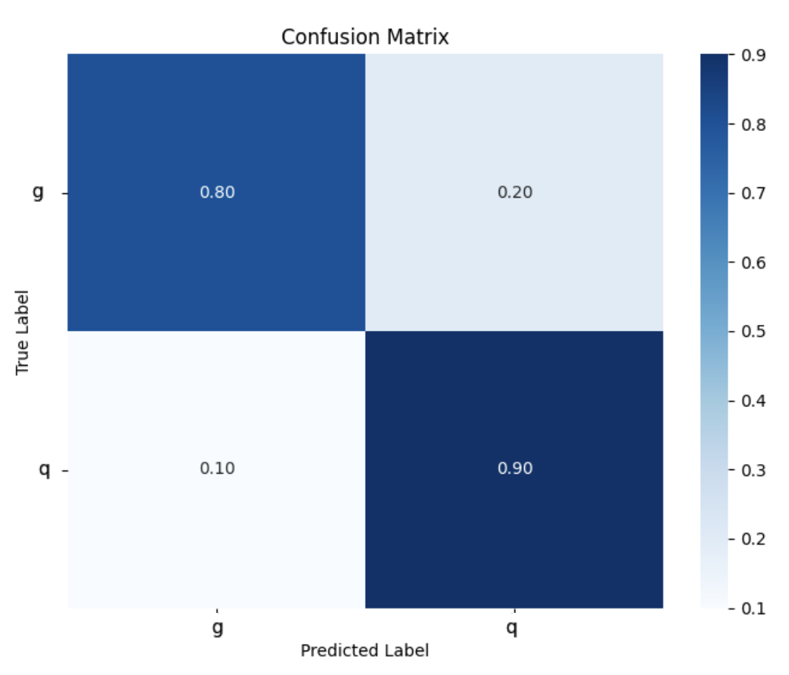

## Jet Tagging with Machine Learning

The Jet_Tagging repository is designed to classify particle jets in high-energy physics experiments. It utilizes machine learning techniques to distinguish between different types of jets, such as those originating from quarks or gluons.

Key Features:

Model Architectures: Includes implementations of various neural network architectures tailored for jet tagging tasks.

Training Pipelines: Provides scripts and configurations to train models on jet datasets, with support for hyperparameter tuning and performance monitoring.

Evaluation Metrics: Offers tools to assess model performance using standard metrics in particle physics, ensuring reliable and interpretable results.


### Results and Visualizations  

Below are key performance visualizations from **binary** and **multi-class classifiers**.  

### Confusion Matrices  
These confusion matrices illustrate the classification performance of the models.  

<div align="center">  
  <table>  
    <tr>  
      <td align="center"><strong>Binary Classifier (Quark vs Gluon)</strong></td>  
      <td align="center"><strong>Multi-Class Classifier</strong></td>  
    </tr>  
    <tr>  
      <td></td>  
      <td></td>  
    </tr>  
  </table>  
</div>  

### Directories and Files

- **README.md:** Project documentation and instructions.
- **config/:** Configuration files for various setups.
- **data/:** Scripts and utilities for handling datasets.
- **evaluation/:** Evaluation scripts and results.
- **images/:** Generated figures and plots.
- **launch_project.py:** Script to launch the project.
- **models/:** Directory for model definitions and architectures.
- **scripts/:** Miscellaneous scripts for different tasks.
- **summary/:** Summaries and logs of training runs.
- **trainers/:** Training scripts and utilities.
- **utils/:** Utility functions and helpers.

## Getting Started

### Prerequisites

- Jetnet (https://github.com/jet-net/JetNet.git) 
- Python 3.10
- Pytorch 2.4.1


### Download

1. Clone the repository:
    ```sh
    git clone git@github.com:CarlosSarasty/Quark_Gluon_Classifier.git 
    ```
2. Navigate to the project directory:
    ```sh
    cd Quark_Gluon_Classifier
    ```

### Usage

To launch the project, run:
```sh
python launch_project.py config/config.yaml

